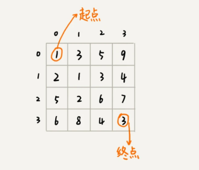

> 第 0 个（下标从 0 开始编号）物品的重量是 2，要么装入背包，要么不装入背包，决策完之后，会对应背包的两种状态，背包中物品的总重量是 0 或者 2。我们用 states[0][0]=true 和 states[0][2]=true 来表示这两种状态。
> 第 1 个物品的重量也是 2，基于之前的背包状态，在这个物品决策完之后，不同的状态有 3 个，背包中物品总重量分别是 0(0+0)，2(0+2 or 2+0)，4(2+2)。我们用 states[1][0]=true，states[1][2]=true，states[1][4]=true 来表示这三种状态。

# 我们记录每一个阶段可达的状态集合（去掉重复的），然后通过当前阶段的状态集合，来推导下一个阶段的状态集合，动态地往前推进。

